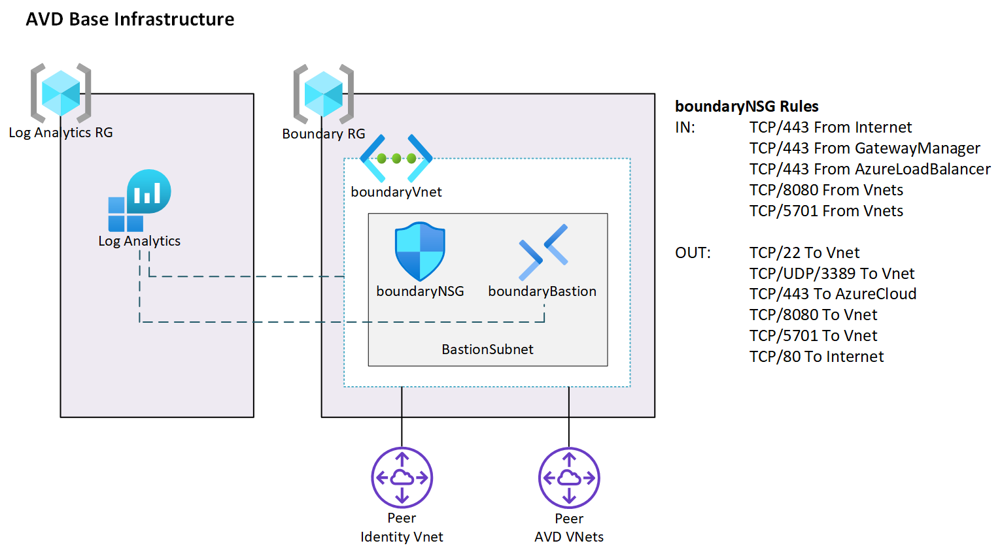

# 2.0 Base Infrastructure



## What this does

This script sets up two base components:

1. A central Log analytics Workspace where all components will report diagnostics information
1. A boundary vnet and Bastion to allow connectivity

## Requirements

Prior to running this script you MUST have updated deployConfig.ps1 for your environment.  You can find this powershell module in \PSConfig\deployConfig.psm1.  See the [README](../PSConfig/README.md) in that section for more information.

## Running the Script

The script "deploy.ps1" takes several arguments:

- localenv
    - (required) Typically either dev or prod depending on the environment you want to deploy in
- dryrun
    - (optional) DryRun allows you to see what will be deployed before any changes are made.  Defaults to true
- dologin
    - (optional) DoLogin allows you to enable to disable the Azure login prompt.  Defaults to true
- deployBastion
    - (optional) DeployBastion tells the script to either deploy or not deploy Bastion.  Defaults to true

## Examples

Deploy using the main defaults to the DEV environment.  It will do a DryRun and log you into Azure as well as deploy Bastion.

```powershell
.\deploy.ps1 -localenv dev
```

Deploy to the DEV environment, deploy live and make changes and disable the Azure login prompt.  why would you disable the login prompt?  Well, once you have logged in once you don't need to do it again until the session token expires.

```powershell
.\deploy.ps1 -localenv dev -dryrun $false -dologin $false
```