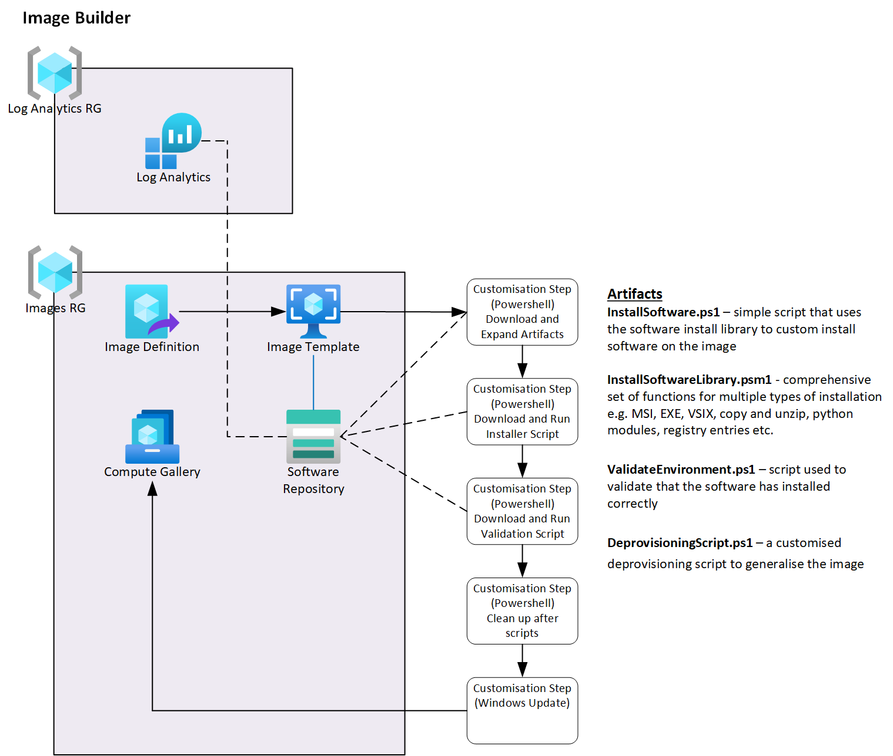

# 2.0 Base Infrastructure



## What this does

This creates the infrastructure required for the Image Builder to function.  This includes a compute gallery where images will be stored and provides storage for build scripts and software to be installed.

There are two parts to this script:

1. Deployment of the compute gallery and storage components
1. The deployment of Image Definition and Template

Once deployed, it will then build the image.

## Requirements

Prior to running this script you MUST have updated deployConfig.ps1 for your environment.  You can find this powershell module in \PSConfig\deployConfig.psm1.  See the [README](../PSConfig/README.md) in that section for more information.

You must also take a look at the .\2a_SingleEnv\InstallSoftware.ps1 script and determine what you want to install into the image.  It manages software from both the blob software repo, package manages such as chocolately plus it will move files into position, add registry entries and configure things like RSAT tools etc.

# Notes

Traditionally, you would deploy this to DEV only then create a pipeline to COPY the image from DEV compute gallery to the PROD compute gallery.  However, there is now an optional step as different subscriptions can now use a single gallery.  Both have merits, a single gallery's images can be tagged with DEV then promoted to PROD once tested and is cheaper to run, but this requires more logic.  Dual gallerys keep dev and prod fully separate with a formal gateway and approval process to transfer it to prod. This is more expensive to run, but is more secure with less risk

# Single Compute Gallery

This provides a single environment image builder and compute gallery.  This can then be used as part of a single compute gallery deployment.

# Multi Compute Gallery

(TO BE COMPLETED - FUTURE)

This builds both a DEV AND PROD (though you could also have other in-between stages as well) environment where the DEV environment provides an image builder infrastrcture and dev compute gallery and the production environment provides just a compute gallery.  Provided is two ways to copy the image from the dev to the production compute gallery - a simple powershell script that jsut copies the latest image over, and a more comprehensve YAML pipeline that monitors runs continuous development of the dev environment (monitoring changes to the build) AND an approval process that then copies the file from DEV to PROD.

# The Builder environment (relevant to both environments)

This provides the image builder infrastructure including a dedicated storage account that provides a "repo" of software that the images can call on as part of the build.  The builder also leverages examples of both "chocolatey" and "winbuild" to show how both of these could be used as well.

# Requirements for Software deployment to an Image

Each desktop deployment has a set of requirements associated with it:

1. The deploy.bicep - defines the parameters for the desktop and what to actually build
1. The InstallSoftware.ps1 - a script that uses the common InstallSoftwareLibrary module to actually manipulate the image and install software
1. The ValidateEnvironment.ps1 - a script that is used as part of the build to validate the environment.

## The deploy.bicep

The deploy.bicep provides a number of customisation sections and needs to be customised to suit your needs.  The two main areas for customisation are:

- sourceImage
    - The source image defines which base image to use as part of the build.  Typically this is a Windows 10 or 11 AVD specific MultiSession image is using this process for AVD, but can also be your own custom image or a standalone image as well
- customizationSteps
    - This is where the Image Builder does the work of customising the image by calling several Packer Features.  A typical build would be:
        1. Download the build scripts
        1. Run the InstallSoftware.ps1 script
        1. Run the ValidateEnvironment.ps1 script
        1. Reboot the VM
        1. Do windows updates
        1. Reboot the VM
        1. Generalise the image

    - This can, of course, be anything you want in the image build and in any order.  For example, if you need a reboot between installations of different packages, you would create two InstallSoftware.ps1 scripts, then add a reboot and another Powershell section to the customizationSteps.

## The InstallSoftware.ps1 script

This script does the customisation of the image.  Everything defined in here is designed to install software or manipulate the image to make it the image you require.  It relies heavily on the InstallSoftwareLibrary.psm1 powershell module to automate and simplify the installation of software and customisation of the image, however it is not an absolute requirement - you can add whatever you want to this powershell script to customise the image though powershell in any way.

Just remember though that:
1. This script will run as a local admin during the build, so user installed software CANNOT be installed this way.  An example of this is VS Code Extensions.
1. The VM you are running the build is not and MUST NOT be joined to the domain otherwise it will not generalise properly.
1. The installation script is designed to operate from a single Azure storage account Blob container - If you need to use multiple containers, then you will need to build and launch a separate installer script for each one.

## The ValidateEnvironment.ps1 script

This script is really up to you.  Some basic checks have been added by way of example, but this script is to help you automate the checking and validation of the image you have just built e.g. to ensure all the software has installed correctly.


# Building an image
## Prep the image folder

In order to build the image you will need to:
1. Create a new folder (suggest the name of the image)
1. Copy in (or create new) the deploy.bicep - modify this as required
1. Create a sub-folder called "BuildScripts"
1. Copy into this (or create new), the InstallSoftware.ps1 and ValidateEnvironment.ps1 scripts

## Validate the build script

In this deployment, there are two build scripts:

1. 1_deployCommon.ps1
    - This provides the gallery, storage account and uploads the contents of the "Components/TEstSoftware" folder to a "repository" container

1. 2a_deploySingleEnv.ps1 **OR** 2b_deployMultiEnv.ps1
    - Check then run either of these two scripts to configure the UMI and permissions, upload the build scripts and create the image

You will need to make sure that PSConfig/deployConfig.psm1 is correct which, if you have been following the series, should have been done earlier.

## Deploying Common elements

The script "deploy.ps1" takes several arguments:

- localenv
    - (required) Typically either dev or prod depending on the environment you want to deploy in
- dryrun
    - (optional) DryRun allows you to see what will be deployed before any changes are made.  Defaults to true
- dologin
    - (optional) DoLogin allows you to enable to disable the Azure login prompt.  Defaults to true
- doTestFileUpload
    - (optional) doTestFileUpload tells the script to take the contents of the TestSoftware folder (found within Components) and upload it to the repo container.  Defaults to true

## Examples
Deploy using the main defaults to the DEV environment.  It will do a DryRun and log you into Azure as well as deploy repo storage and compute gallery.

```powershell
.\deployCommon.ps1 -localenv dev
```

Deploy to the DEV environment, deploy live and make changes and disable the Azure login prompt.  why would you disable the login prompt?  Well, once you have logged in once you don't need to do it again until the session token expires.

```powershell
.\deployCommon.ps1 -localenv dev -dryrun $false -dologin $false
```

## Deploying for a Single Environment

Once the storage repo and compute gallery have been deployed, this script builds an Image Definition and Image Template in preparation for the image to be built by ImageBuilder.  

- localenv
    - (required) Typically either dev or prod depending on the environment you want to deploy in
- dryrun
    - (optional) DryRun allows you to see what will be deployed before any changes are made.  Defaults to true
- dologin
    - (optional) DoLogin allows you to enable to disable the Azure login prompt.  Defaults to true
- installModules
    - (optional) installModules tells the script to install the required PowerShell modules on the system running this script.  Defaults to false
- buildImage
    - (optional) buildImage tells the script to build the image if set to true.  Defaults to true

### Examples
Deploy using the main defaults to the DEV environment.  It will do a DryRun and log you into Azure and run a dry run but make no changes

```powershell
.\deployCommon.ps1 -localenv dev
```

Deploy to the DEV environment, deploy live and make changes and disable the Azure login prompt.  why would you disable the login prompt?  Well, once you have logged in once you don't need to do it again until the session token expires. 

```powershell
.\deployCommon.ps1 -localenv dev -dryrun $false -dologin $false


## Deploying for a Multiple Environment

(FUTURE)
