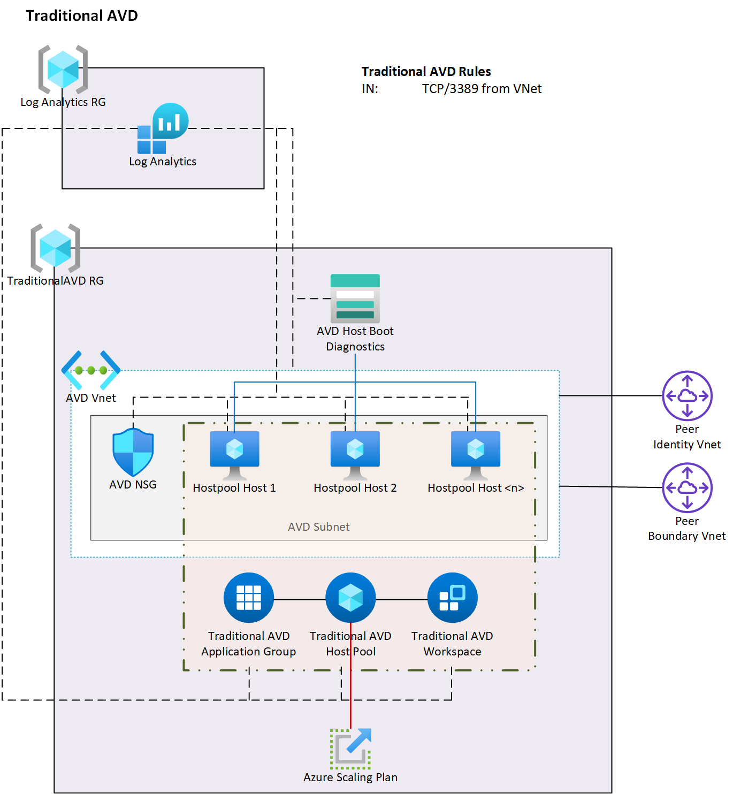

# 2.3 Traditional AVD Deployment



## What this does

This is considered the traditional AVD deployment which consists of a host pool (plus supporting components) and a number of pre-built virtual machine added to that pool and the Azure Scaling Plan to managing the turning on and off of those machines.

# Requirements

- A working Active Directory that supports domain objects, whether that is Azure Active Directory Domain Services (AADDS) or a virtual machine based Active Directory Domain Services (ADDS).  This is required as the virtual machines need to be domain joined.

- Connectivity between the AD and Azure Active Directory.  This is required for testing the AVD login.  It is possible to do it without that connectivity but you will lose a lot of the experience.  If you have AADDS, this is already implemented.  If you have a VM based AD (ADDS) then you will need to set up either AD Connect Cloud Sync or AD Connect (if you have not already done this).

- At least one non-admin account in AAD that will be used to log into the Host Pool (Added as an "Assignment" in the Application Group once created).  If using VM based ADDS, then this user should have ideally been created there and sync'ed up to AAD.

- A valid image - you can update the 2_hosts.bicep if you want to use a stock image otherwise it will use the image built in 2.2.

# Deployment

There are three bicep scripts used in the deployment, all of which are called from the 1_DeployTraditionalAVD.ps1 script.

1. Deploy the AVD networks, NSG, Hostpool, Appgroup and Workspace 
1. Deploy a boot diag account and the virtual machine, joining them to the hostpool
1. (optional) Deploy the Azure Scaling Plan

## The deployment script

The deployment script has a set of common parameters and a set of deployment options.

 localenv
    - (required) Typically either dev or prod depending on the environment you want to deploy in
- dryrun
    - (optional) DryRun allows you to see what will be deployed before any changes are made.  Defaults to true
- dologin
    - (optional) DoLogin allows you to enable to disable the Azure login prompt.  Defaults to true
- deployHostPool
    - (optional) deployHostPool by default deploys the host pool - defaults to True
- deployHosts
    - (optional) deployHosts will tell the script to deploy the VM hosts and join them to the hostpool - Defaults to True
- deployScaler
    - (optional) deployScaler deploy the Azure Scaling Plan for the Hostpool - Defaults to True

### Examples
Deploy using the main defaults to the DEV environment.  It will do a DryRun and log you into Azure and run a dry run but make no changes

```powershell
.\deployCommon.ps1 -localenv dev
```

Deploy to the DEV environment, deploy live and make changes and disable the Azure login prompt.  why would you disable the login prompt?  Well, once you have logged in once you don't need to do it again until the session token expires. 

```powershell
.\deployCommon.ps1 -localenv dev -dryrun $false -dologin $false
```

# Managing the Hostpool

If you are **not** using a custom image and just want to use a Microsoft stock image you will need to replace and comment out some things otherwise jump on down the the "To run the build below".

The following needs to be replace:

```bicep
imageReference: {
    id: ComputeGalleryImage.id
}
```

in the *2_hosts.bicep* with something like this:

```bicep
imageReference: {
    offer: 'office-365'
    publisher: 'MicrosoftWindowsDesktop'
    sku: 'win10-22h2-avd-m365-g2'
    version: 'latest'
}
```

Would would also need to comment out the two gallery existing resource pulls

```bicep
//Pull in the Compute Gallery
// resource ComputeGallery 'Microsoft.Compute/galleries@2022-03-03' existing = {
//   name: galleryName
//   scope: resourceGroup(gallerySubscriptionId,galleryRG)
// }

// //Pull in the Compute Gallery Image
// resource ComputeGalleryImage 'Microsoft.Compute/galleries/images@2022-03-03' existing = {
//   name: galleryImageName
//   parent: ComputeGallery
// }
```

# Support Scripts

You will find a folder called "UsefulScripts".  Inside this folder are four helper scripts and a library:

**AddHosts.ps1**

This script will build additional hosts and add them to the host pool.  Aside the normal parameters, it takes a variable called "addHosts" which takes an integer indicating the number of hosts to add to the pool.

Example:

```powershell
AddHosts.ps1 -localenv dev -dryrun $false -dologin $false -addHosts 10
```

This will add 10 hosts to the AVD deployment.  It will pick up the Traditional AVD settings from the config.  It could simply be expanded to do this for any host pool.

**RemoveHosts.ps1**

This script does the opposite and will remove hosts from the host pool.  It is considerate in that it will remove hosts that are powered off first, then hosts with no users, then hosts with users (with a user warning).  It will always try and remove the oldest hosts first.

The script captures enough detail to provide a number of other possible future options i.e. create a parameter that determine the type of host to remove (oldest, most users, least users, etc) then compile the list of hosts to remove.

As with AddHosts.ps1, RemoveHosts.ps1 has a variable "removeHostsCount".  This is required for the script to run and takes an integer.  It will then remove that many hosts from the pool and the associated Virtual Machines.

Example:

```powershell
RemoveHosts.ps1 -localenv dev -dryrun $false -dologin $false -removeHostsCount 10
```

**CleanHostPool.ps1**

This script, when run, will check the host pool for any hosts that are orphaned and remove them from the pool

**SetScalePlanState.ps1**

This script takes an additional variable called "enabled" which is boolean and can either be true or false.  It will enable to disable toe Azure Scaling Plan specifically associated with this HostPool.

**HostLibrary.psm1**

This is a library of functions used by the other scripts.


# Deployment


# Scaling


# Logging in

## With a Sync'ed AD account

## With just a local AD account
